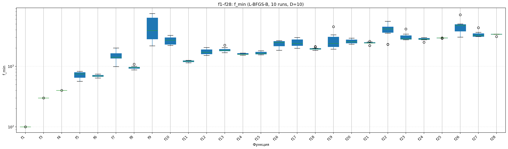
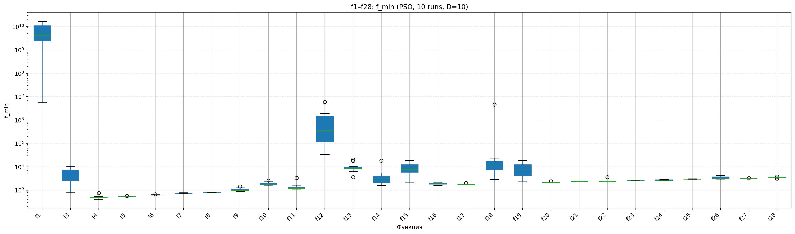
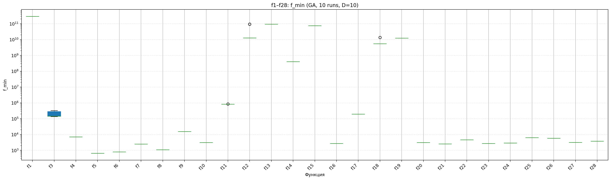
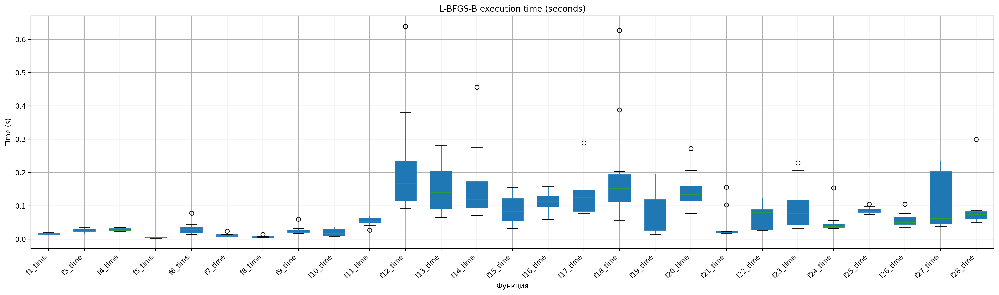
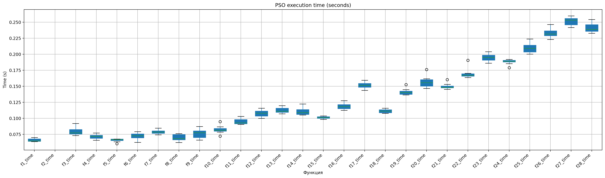
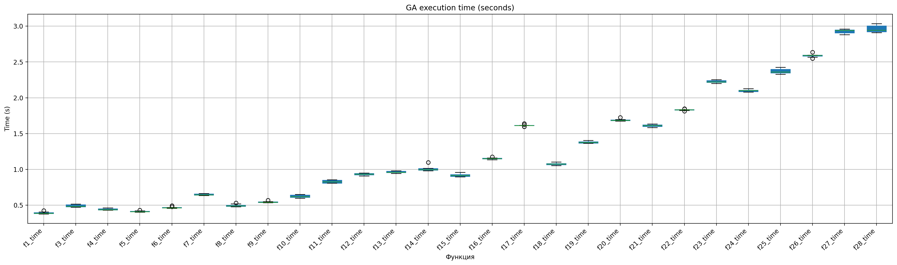

# Math_opt_spring_2026


## Требования

- **Python** ≥ 3.8
- **Conda** (рекомендуется) или `pip`
- Зависимости:
  - `numpy`
  - `matplotlib`
  - `setuptools`
  - `pandas`
  - `scipy`
  - `pyswarms`
  - `pygad`
  - `scikit_posthocs`

## 1. Установка

### 1.1 Клонирование репозитория

```bash
git clone https://github.com/your-username/Math_opt_spring_2026.git
cd Math_opt_spring_2026

# Инициализация субмодуля с библиотекой CEC2017
git submodule update --init --recursive
```

### 1.2 Создание окружения conda:
```bash
conda create -n opt_env python=3.10 numpy matplotlib setuptools pandas scipy pyswarms pygad -y
conda activate opt_env
pip install scikit_posthocs
```

### 1.3 Устновка пакета CEC2017:
```bash
pip install -e ./cec2017-py
```

## 2.Визуализация функций из бенчмарка **CEC 2017** 
```bash
python src/plot_f1_f10.py
```
Результаты сохраняются в папку **plots**

## 3.1 Оптимизация 10-мерных случаев (scipy)
```bash
python src/optimize_scipy.py
```
Результаты сохраняются в папку **results/optimization_l_bfgs_b.csv**

## 3.2 Оптимизация 10-мерных случаев (PSO)
```bash
python src/optimize_pso.py
```
Результаты сохраняются в папку **results/optimization_pso.csv**

## 3.3 Оптимизация 10-мерных случаев (GA)
```bash
python src/optimize_ga.py
```
Результаты сохраняются в папку **results/optimization_ga.csv**

## Результаты







Анализ результатов минимизации функций f1–f28 продемонстрировал существенную зависимость эффективности алгоритмов от типа оптимизационной задачи. Градиентный метод L-BFGS-B показал наилучшую точность на унимодальных функциях (f1-f4), достигая значений, близких к теоретическим, что объясняется его способностью использовать информацию о градиенте и аппроксимации гессиана для быстрой локальной сходимости на гладких унимодальных функциях; однако на других функциях его преимущество сокращается из-за наличия множества локальных минимумов и сложной структуры целевой функции. Метод роя частиц (PSO) продемонстрировал высокую дисперсию результатов на некоторых функциях и чувствительность к инициализации, алгоритм часто преждевременно сходится к субоптимальным решениям из-за потери разнообразия роя; при этом на некоторых композиционных функциях PSO показывает результаты, сопоставимые с градиентным методом, благодаря стохастической природе поиска. Генетический алгоритм (GA) показал наихудшую точность, что обусловлено неэффективностью операторов кроссовера и мутации, работающих независимо по координатам, на повёрнутых функциях CEC-2017, где переменные сильно коррелированы, а малый размер популяции (20 особей) и отсутствие адаптивных механизмов приводят к быстрой потере генетического разнообразия и застреванию в локальных минимумах. 







По времени выполнения L-BFGS-B показал наибольшую вариабельность (0.02-0.6 с), связанную с различным числом итераций, необходимым для достижения сходимости на функциях разной сложности, PSO продемонстрировал стабильное время (0.1-0.25 с) благодаря фиксированному числу итераций и частиц, тогда как GA показал монотонный рост времени с усложнением функций (0.4-2.6 с), что отражает вычислительную стоимость эволюционных операторов на композиционных функциях с плотными матрицами вращения.

## Результаты тестов

|  | L-BFGS-B  | PSO | GA|
|--- | -------- | ----- |--|
| L-BFGS-B  | 1.0000 | 0.6069 |0.0001 |
|  PSO | 0.6069 | 1.0000  | 0.0000 |
|  GA | 0.0001 |  0.0000   | 1.0000  |

Статистический анализ с использованием теста Фридмана и пост-хок теста Неменьи показал наличие значимых различий между методами оптимизации на бенчмарке CEC2017 ($\chi^2 = 30.2963, p < 0.001)$. Попарное сравнение выявило, что градиентный метод L-BFGS-B и метод роя частиц (PSO) не различаются статистически (p = 0.61), тогда как генетический алгоритм демонстрирует статистически значимо более высокие значения целевой функции (т.е. худшую точность) по сравнению с L-BFGS-B и PSO (p < 0.001 для обоих сравнений), что подтверждается более высоким средним рангом в тесте Фридмана.